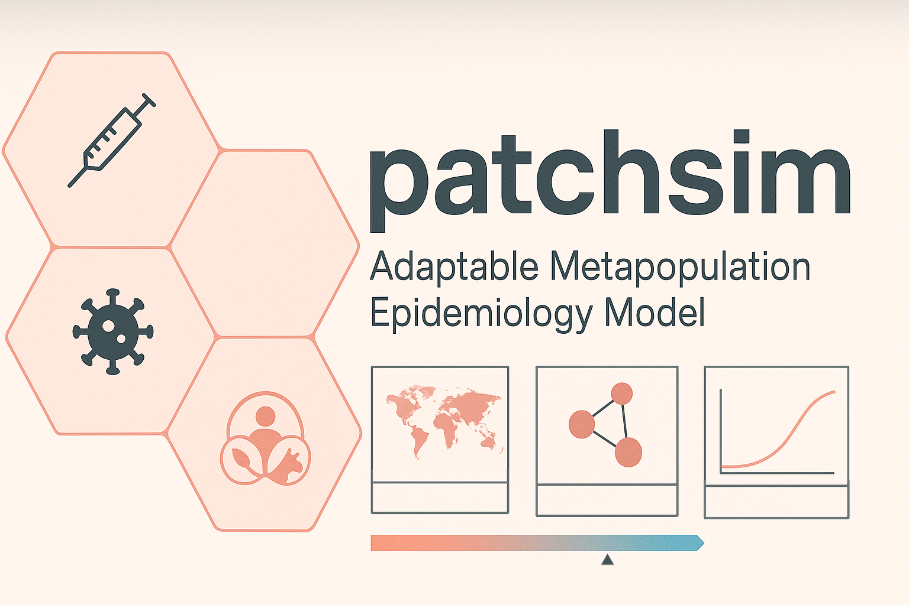

# PatchSim

> ⚠️ **WARNING: Active Development**  
> PatchSim is currently under **heavy development**. Features are experimental and subject to change. Not recommended for production use at this stage.



**PatchSim** is a modular metapopulation simulation framework for multi-disease epidemiological modelling.

---

## Vision

To develop a general-purpose, modular simulation framework for patch-based metapopulation epidemiology, enabling modellers and researchers to simulate disease transmission under diverse scenarios, diseases, and intervention strategies. The framework balances robust scientific modelling with flexibility for exploratory research and translational use cases.

---

## Core Features

PatchSim aims to support a range of modelling features commonly used in metapopulation disease simulations:

- 🗺️ **Spatial Networks**: Represent geographical units (e.g., subdistricts, regions) as interconnected patches with movement/contact matrices.
- 👥 **Stratification by Population Attributes**:
  - **Age groups**
  - **Species (e.g., cattle, buffalo)**
  - **Risk groups or occupations**
- 🧪 **Disease Agnostic Compartment Models**:
  - SIR, SEIR, SIRS and extensions
  - Supports both discrete timestep and ODE-based solvers
- 🛠️ **Scenario and Parameter Management**:
  - Batch simulations for scenario comparison
  - Sensitivity analysis and parameter sweeps
- 🧵 **Reproducibility**:
  - Random seed control and metadata logging
  - Version-tracked configurations
- 📦 **Modularity**:
  - Plug-in architecture for solvers, interventions, and input data pipelines

---

## Installation

To install PatchSim using [PDM](https://pdm-project.org):

```bash
# Clone the repository
git clone https://github.com/yourusername/patchsim.git
cd patchsim

# Install dependencies and lock the environment
pdm install

```
## Contributing

We welcome contributions!

To contribute: fork the repo, create a branch, make your changes, and open a pull request.  
For major changes, please open an issue first to discuss.

Thanks for helping improve the framework!


## License

This project is licensed under the **GNU General Public License v3.0**.

[](https://www.gnu.org/licenses/gpl-3.0)

You may use, modify, and share this project under the same license terms. See the [LICENSE](./LICENSE) file for full details.
