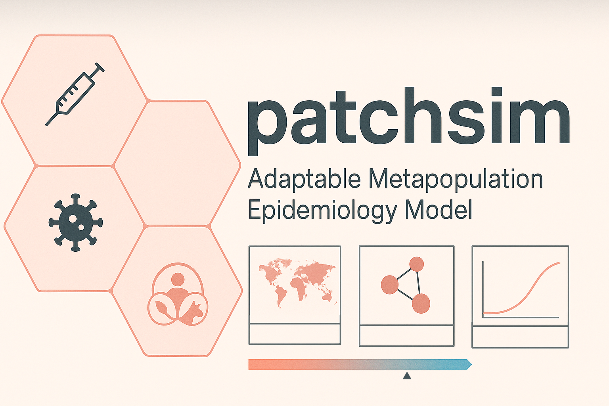

# PatchSim

> **Release status:** PatchSim follows semantic versioning. Before 1.0, minor releases
> may contain breaking API or configuration changes.



**PatchSim** is a modular metapopulation simulation framework for multi-disease epidemiological modelling.

[Documentation](https://patchsim.readthedocs.io/) |
[GitHub repository](https://github.com/dsih-artpark/patchsim)

---

## Vision

To develop a general-purpose, modular simulation framework for patch-based metapopulation epidemiology, enabling modellers and researchers to simulate disease transmission under diverse scenarios, diseases, and intervention strategies. The framework balances robust scientific modelling with flexibility for exploratory research and translational use cases.

---

## Unique Selling Point (USP)

PatchSim combines metapopulation network dynamics with a lightweight, configuration-first workflow:

- Network-aware compartment transitions across connected patches
- Arrow-map transition syntax in YAML for explicit model specification
- Fast iteration loop from config edits to reproducible outputs

---

## Unique Value Proposition (UVP)

Compared to many epidemiology tools that are either code-heavy or tightly bound to a specific disease model, PatchSim offers:

- **Model flexibility**: define SIR/SIRS-style variants through config transitions
- **Research-friendly reproducibility**: deterministic inputs, logged runs, and versioned config files
- **Dual interface**: SDK import for programmatic workflows and CLI for operational runs
- **Extensibility path**: built-in structure for adding custom models and project templates

---

## Core Features

PatchSim aims to support a range of modelling features commonly used in metapopulation disease simulations:

- 🗺️ **Spatial Networks**: Represent geographical units (e.g., subdistricts, regions) as interconnected patches with movement/contact matrices.
- 👥 **Stratification by Population Attributes**: Use a generic group axis for age,
  species, behavioural risk, occupation, or another categorical partition, with an
  explicitly supplied interaction matrix.
- 🧪 **Disease Agnostic Compartment Models**:
  - SIR, SEIR, SIRS and extensions
  - Supports both discrete timestep and ODE-based solvers
- 🛠️ **Scenario and Parameter Management**:
  - First-order and total-order Sobol sensitivity analysis for bounded global
    parameters
  - Compact samples, responses, indices, and provenance artifacts
- 🧵 **Reproducibility**:
  - Seeded sensitivity sampling and confidence intervals
  - Input hashes and method versions in sensitivity manifests
- 📦 **Modularity**:
  - Built-in ODE and discrete solvers consume the same validated spatial network
    format

---

## Installation

Install from PyPI:

```bash
pip install patchsim
```

Sensitivity analysis uses an optional dependency:

```bash
pip install "patchsim[analysis]"
```

Install from source using [uv](https://github.com/astral-sh/uv):

```bash
# Clone the repository
git clone https://github.com/dsih-artpark/patchsim
cd patchsim

# Create a virtual environment and install dependencies
uv venv
source .venv/bin/activate
uv pip install -e .

# For development (with dev dependencies)
uv pip install -e .[dev]
```

---

## Usage

### Command Line Interface

PatchSim provides a subcommand-based CLI. Always run using `uv run` to ensure correct dependency resolution:

```bash
# Show help and available options
uv run patchsim --help

# Show package version
uv run patchsim --version

# Initialize a new self-contained project
uv run patchsim init my-project

# Initialize with a starter template
uv run patchsim init my-project --template seir

# Validate config without running
uv run patchsim validate -c my-project/config.yaml

# Print the JSON Schema for configs
uv run patchsim validate --schema

# Emit machine-readable JSON output
uv run patchsim validate -c my-project/config.yaml --json

# Run simulation
uv run patchsim run -c my-project/config.yaml

# Run and emit machine-readable JSON output
uv run patchsim run -c my-project/config.yaml --json

# Run or reuse a configured Sobol sensitivity study
uv run patchsim sensitivity -c my-project/config.yaml

# Run or reuse a configured bounded calibration study
uv run patchsim calibrate -c my-project/config.yaml

# List built-in model references and YAML templates
uv run patchsim list-models

# List models as JSON
uv run patchsim list-models --json
```

### Python SDK

```python
import patchsim

config = patchsim.load_config("config.yaml")
frame = patchsim.simulate(config, parameter_overrides={"beta": 0.08})

# A configured built-in fit writes verified study artifacts
summary = patchsim.run_calibration("config.yaml")
```

`simulate` returns the configured time series without writing files or mutating
the loaded config. It is the integration point for external fitting code.

### Configuration

YAML configuration defines model parameters, transition expressions, input
files, solver settings, and output location. See the
[configuration reference](https://patchsim.readthedocs.io/en/latest/configuration.html)
and the
[worked simulation, sensitivity, and calibration workflow](https://patchsim.readthedocs.io/en/latest/simulation-workflow.html).

---

## Contributing

We welcome contributions!

To contribute: fork the repo, create a branch, make your changes, and open a pull request.  
For major changes, please open an issue first to discuss.

Thanks for helping improve the framework!


## License

This project is licensed under the **GNU General Public License v3.0**.

[](https://www.gnu.org/licenses/gpl-3.0)

You may use, modify, and share this project under the same license terms. See the [LICENSE](./LICENSE) file for full details.
